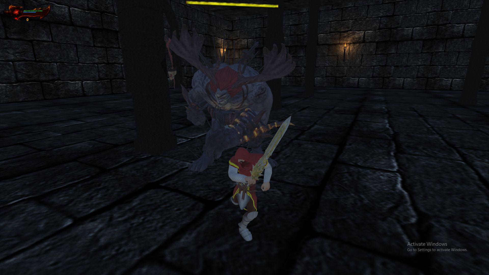

<h1 align=center> Refutation Fractals </h1>

## Overview
A prototype for a third person game where the player has quests that he needs to finish so as to reach the next level.

### Game Levels:
- **Level 1**: The player is spawned in a building with four floors. To reach Level 2 the player needs to reach the last floor. In each floor, the player will fight waves of minions that he needs to kill and level up to be stronger and be able to defeat the boss in Level 2.

	

- **Level 2**:  The player fights the boss which has three weak points each one linked with a certain ability. The player can take advantage of the weak points to make it easier to kill the boss.

	

### Built With:
[**Unity**](https://unity3d.com/): Unity is a cross-platform game engine developed by Unity Technologies

### Running the game:
One can run the game on Windows, Max, Linux & Android operating systems. The builds are included in the corresponding folders.

